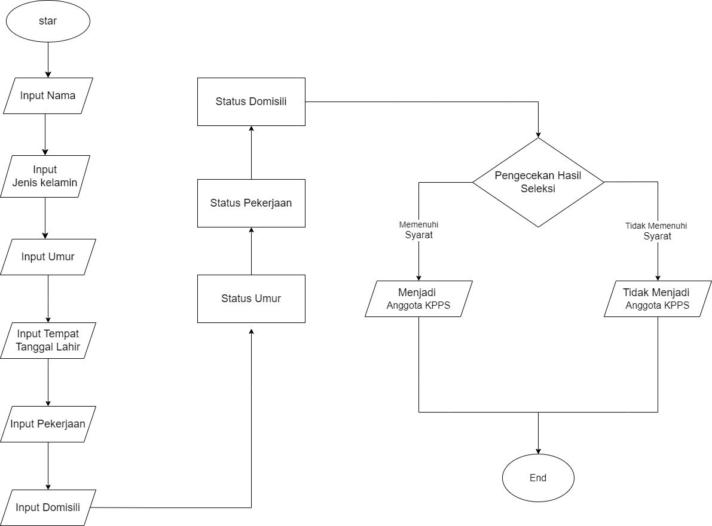

# SELEKSI KPPS PILKADA 2024

## STUDI KASUS
Untuk menyeleksi masyarakat yang ingin menjadi anggota KPPS dan di butuhkan dokumen
persyaratan administrasi untuk memenuhi pasal 72 Undang-Undang Nomor 7 Tahun 2017
tentang pemilihan umum dan pasal 35 peraturan komisi pemilihan umum nomor 8 Tahun 2022
tentang pembentukan dan Tata kerja Badan adhoc penyelenggara Pemilihan Gubernur dan
wakil Gubernur, Bupati dan Wakil Bupati, dan Walikota dan Wakil Walikota.

## FLOWCHART

## PENJELASAN
1. Program dimulai
2. Kode akan dimulai berjalan dengan membrikan input berupa nama, jenis kelamin, umur, dan seterusnya hingga ijazah yang harus diisi oleh user.
3. Kode akan memproses inputan dengan memberikan nilai True dan Flase sebagai hasil proses
4. pada baris hasil seleksi, variabel hasil_seleksi akan memproses hasil pada proses imputan yang kemudian menentukan apakah user berhak menerima kpps atau tidak.
5. Kode akan menampilkan data calon anggota kpps berupa nama, jenis kelamin, umur, dan tempat tanggal lahir 
6. Kode akan menampilkan hasil darii proses Hasil seleksi
7.  program selesai

## PENJELASAN PROSES SELEKSI DAN HASIL SELEKS
1. berusia paling rendah 17 tahun.
2. Berdomisili dalam wilayah kerja PPK, PPS dan KPPS
3. memiliki ijazah SMA
4. Pekerjaan tidak boleh tni, polisi, dokter dan politikus
